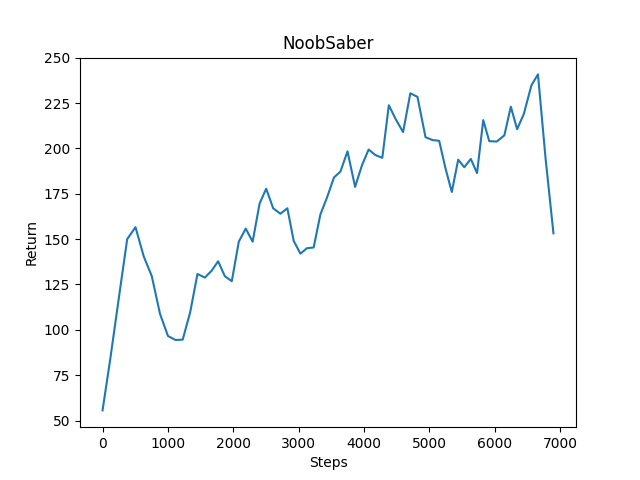

# {{ page.title }}

## Video

[Demo Video](https://www.ics.uci.edu/~tongjiew/cs175/status_report_vid.mp4)

## Project Summary

We are planning to train an AI to play a minigame integrated with features in Beat-Saber (similar to the map in this YouTube video: Zedd & Jasmine Thompson - Funny (Minecraft Music Video \| Beat Synchronized!) but also included features similar to dancing line (similar to this YouTube video: Dancing Line \| The Piano %100 10/10 Gems)).

The task of the AI is trying to hit the block along the railroad while riding on it with swords in the same color with the block. A correct hit will increase the AI's score, and a miss or hitting with a sword in wrong color would decrease the score. The AI should take the game frame as input and perform "switch tools" and "attack at the correct side" actions correspondingly.

Considering the difficulty of the problem and time to train a good AI, we have two versions for this project. The first version (7-direction) involves blocks coming from 7 directions (Top, Upper left, Middle left, Lower left, Upper right, Middle right, Lower right; 2 directions (Front, Bottom) empty for the agent to move).

The second version (2-direction + Redstone) involves only two directions (Left, Right), but to make this task more challenging, the AI will encounter multiple rail ways and have to choose the correct one (other wrong ones will lead to lava). The AI should hit the controling redstone at proper time to switch railways to ride on correct one. The AI will get rewards when it lives, and be punished when it falls into lava.

This problem/setting needs AI/ML algorithm to solve it because it is quite hard for humans to manually play this game perfectly in Minecraft, while the cart drives relatively fast and features and blocks appear frequently. A simple if-else algorithm could be implemented, however, considering how fast the agent is moving and how fast the blocks are approaching, the agent would require a huge 3-D observation space in order to capture the upcoming items, which is very inefficient and memory-consuming. Thus, in this problem, an AI/ML algorithm which learns features from a smaller 2-D game frame is more favorable. For an AI to play such games, it will need convolutional neural networks and reinforcement learning to learn when blocks are approaching and where and when it needs to hit the blocks to earn scores and keep living.

## Approach

### Rewards

To reward our agent during training, we are considering 4 factors: completion of the task, the time the agent survived, the number of correct hits, and the number of wrong hits. We considered two ways to reward the agent's survival time, the first of all is the time ticks taken. However, it turned out that time ticks are very unstable: each episode gains slightly different values for time ticks, even they all complete the task, which creates a lot of noises during training. Thus, we choose to reward the agent for each Redstone hit since it switches the agent to the correct railroad and leads to longer survival. In terms of task completion, the agent will gain a reward if it finishes the task or punished if it dies (fail to switch railways). The reward function could be written in this linear combination:

For hitting blocks + Death (7-direction && 2-direction + Redstone):

- Hit blocks correctly (hit the block with the tool in the same color): 10
- Hit blocks incorrectly (hit the block with the tool in a different color): -1
- Die for whatever reason: -1

For mission completion (2-direction + Redstone):

- Hit redstone: 1
- Safely complete the mission without falling into the lava (which means the AI correctly hits all the lever redstones): 1
- Fall into the lava: -1

### Action spaces

7-direction:

- 0: No action
- 1: Attack left
- 2: Attack left down
- 3: Attack left down
- 4: Attack left up
- 5: Attack right
- 6: Attack right down
- 7: Attack right up
- 8: Switch tool

2-direction + Redstone Branching:

- 0: No action
- 1: Attack left
- 2: Attack right
- 3: Switch tool

### Observation / Information for the AI

- the center (396x314) of the current frame (960x540)

    

- It is worth mentioning that our agent rides on the railroad at high-speed and it needs to perform two tasks when seeing a block
    1. decide whether it needs to switch weapon
    2. turn the camera and hit. By testing, we decided that this resolution is good enough for the agent to foresee the coming blocks and make reactions.

### Model

Deep Q Network

- Framework: RLlib
- Library: PyTorch

#### Neural network structure

3-layer Convolutional Neural Network

- nn.Conv2d(3, 6, 3) -> relu -> max_pool -> nn.Conv2d(6, 16, 3) -> relu -> max_pool -> nn.Conv2d(16, 32, 3) -> relu -> max_pool
- Input: the resized frame (shape=(314, 396, 3))
- Activation: relu, max_pool

3-layer Fully Connected Neural Network

- Output: action index

### Comparisons with the past approaches

#### Structure Changes

At the beginning: QNetwork model: a 6-layer forward-feeding neural network. No framework.

- Advantages: Easy to program, manage and debug.
- Disadvantage: Not as efficiency as later models.

Later: PPO in default setting. Framework: RLlib.

- Advantages: Better performance compared to the previous QNetwork model. With the framework RLlib, we can complete more tasks and use more powerful functions by following the API and don't need to worry about many details.
- Disadvantages: The AI learns slowly and seems not learning the frame very efficiently. This model takes a long time but not accomplish much.

Present: DQN model with CNN and FNN layers. Framework: RLlib.

- Advantages: With CNN layers, the AI is able to more efficiently learn the frames and make more correct decisions based on that.

#### Version Changes and Concerns

7-direction:

- At the beginning, we considered to add branches and redstone controllers to the 7-direction version, but it appears that it is quite hard for the AI to learn to survive and earn scores. Besides, it is easy for the AI to hit the railroad, which stops the training process. Due to difficulty, training efficiency and limited time concerns, we decided to remove this feature in 7-direction version.

2-direction + redstone:

- In 2-direction version, the agent won't hit the railroad, so we keep the redstone controller in this version.

#### Rewards changes

Punishment for attacks

- Purpose: to train the agent not to favor spamming attacks in one direction
- Failure reason: not work very efficiently

Rewards for falling into the lava or reaching the destination

- Original: falling into the lava: -1000; reaching the destination: 10000
- Now: falling into the lava: -1; reaching the destination: 1
- Purpose: to encourage the agent to avoid death but survive
- Failure reason: not work very efficiently; sometimes the frame that the action happens will be cut out for unknown reasons and Malmo fails to catch that reward. To prevent a huge influence from such incidences, we lowered the impact of completion reward and the penalty for death.

Rewards for time living v.s. Rewards for hitting redstone

- Original: rewards for time living (time ticks)
- Now: rewards for hitting redstone
- Reason: For many times the agent fails to get the rewards pertick. It is caused possibly by program delays and other delays. For this reason, we use rewards for hitting redstones instead. If the agent fails to hit redstones, it will fall into the lava and die, which means it will lose all possibilities to get many rewards from the blocks on the following railroads.

#### Model and Framework Changes

- Original: PPO
- Now: DQN
- Reason: PPO trains slowlier than DQN and for unknown reasons, it often raises exceptions. To increase efficiency and make the training process more stable, we switch from PPO to DQN.

## Evaluation

### Quantitative Evaluation

The total score the agent receives after completing each episode is one evaluation criteria. The higher the score, the longer the agent lives, and the better its performance is. Scores will consist of different parts including living (penalty for not hitting lever and ride into lava), correct hitting (hit the block with the tool in the same color), and hitting timing. We will use random agents as the first baseline, human-player score as the second baseline, and train the agent to perform better than act randomly and approach the manual performance.

#### 7-Direction

##### Rewards for Random Agent (Baseline)

##### Rewards for Our AI

#### 2-Direction + Redstone

##### Rewards for Random Agent (Baseline)

##### Rewards for Our AI

### Qualitative Evaluation

We will check the result video, how the agent makes decisions, and compare performance between them.

#### 7-Direction

##### Random Agent

##### Our AI

##### Human Player

#### 2-Direction + Redstone

##### Random Agent

##### Our AI

##### Human Player

#### Comments for Qualitative Evaluation

Clearly improvements from random agents:

- Switch weapons with strategies
- Learn to hit the redstone and avoid falling into lava

Still, not as good as human players

- Limitations in training: because of the complexity and difficulty of the problem, the AI needs much time to train to approach the global maximum. It is quite possible that it stucks at local maximum and stay at that level for a long time before it continues to improve.
- Limitations besides of training: The agent can't act as quickly as human beings, which makes it impossible to have similar performance as humans. This might be caused by Program delays, codes operations, etc.

## Resources Used

- Project Malmo - [https://microsoft.github.io/malmo/0.14.0/Documentation/classmalmo_1_1_agent_host.html#ac1421c4ed9ababff1300ea58a37859bc](https://microsoft.github.io/malmo/0.14.0/Documentation/classmalmo_1_1_agent_host.html#ac1421c4ed9ababff1300ea58a37859bc)
- XML Schema Documentation - [https://microsoft.github.io/malmo/0.30.0/Schemas/MissionHandlers.html#element_ContinuousMovementCommands](https://microsoft.github.io/malmo/0.30.0/Schemas/MissionHandlers.html#element_ContinuousMovementCommands)
- DQN - [https://blog.csdn.net/war3gu/article/details/90641076](https://blog.csdn.net/war3gu/article/details/90641076)
- Gitter Microsoft/Malmo - [https://gitter.im/Microsoft/malmo?at=5a5ddf51290a1f456194c199](https://gitter.im/Microsoft/malmo?at=5a5ddf51290a1f456194c199)
- UCI CS 175 HW2 (Due to copyright, we will not include the link to Canvas page here)
- Malmo Platform Tutorial - [https://microsoft.github.io/malmo/0.17.0/Python_Examples/Tutorial.pdf](https://microsoft.github.io/malmo/0.17.0/Python_Examples/Tutorial.pdf)
- Redstone Logic Circuit - [https://minecraft.gamepedia.com/Mechanics/Redstone/Logic_circuit](https://minecraft.gamepedia.com/Mechanics/Redstone/Logic_circuit)
- Redstone Transmission Circuit - [https://minecraft.gamepedia.com/Mechanics/Redstone/Transmission_circuit](https://minecraft.gamepedia.com/Mechanics/Redstone/Transmission_circuit)
- RLlib: Scalable Reinforcement Learning - [https://docs.ray.io/en/latest/rllib.html](https://docs.ray.io/en/latest/rllib.html)
- Convolutional Neural Network Tutorial in PyTorch - [https://adventuresinmachinelearning.com/convolutional-neural-networks-tutorial-in-pytorch/](https://adventuresinmachinelearning.com/convolutional-neural-networks-tutorial-in-pytorch/)
- What is a channel in a CNN? - [https://datascience.stackexchange.com/questions/64278/what-is-a-channel-in-a-cnn](https://datascience.stackexchange.com/questions/64278/what-is-a-channel-in-a-cnn)
- A Comprehensive Guide to Convolutional Neural Networks - [https://towardsdatascience.com/a-comprehensive-guide-to-convolutional-neural-networks-the-eli5-way-3bd2b1164a53](https://towardsdatascience.com/a-comprehensive-guide-to-convolutional-neural-networks-the-eli5-way-3bd2b1164a53)
- CNN with Pytorch for MNIST - [https://www.kaggle.com/sdelecourt/cnn-with-pytorch-for-mnist](https://www.kaggle.com/sdelecourt/cnn-with-pytorch-for-mnist)
- Deep Learning with PyTorch: A 60 Minute Blitz - [https://pytorch.org/tutorials/index.html](https://pytorch.org/tutorials/index.html)
- Deep RL Course - [https://simoninithomas.github.io/deep-rl-course/](https://simoninithomas.github.io/deep-rl-course/)
- An intro to Advantage Actor Critic methods - [https://www.freecodecamp.org/news/an-intro-to-advantage-actor-critic-methods-lets-play-sonic-the-hedgehog-86d6240171d/](https://www.freecodecamp.org/news/an-intro-to-advantage-actor-critic-methods-lets-play-sonic-the-hedgehog-86d6240171d/)
